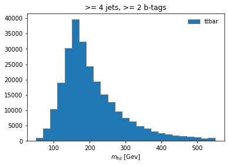
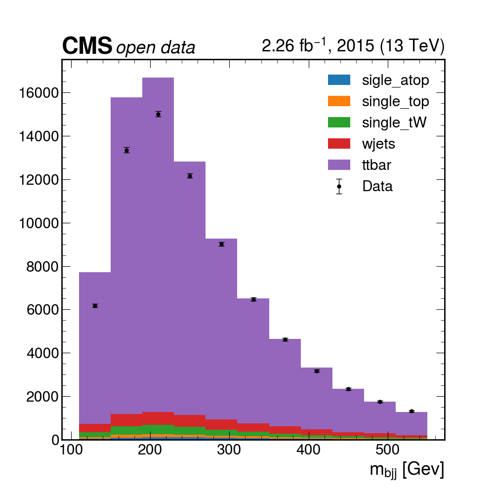

> ## Prerequisites
>
> For this episode please go to your `python` Docker container and clone the repository for this exercise:
>
> ~~~
> git clone https://github.com/cms-opendata-workshop/workshop2022-lesson-ttbarljetsanalysis-payload.git
>
> cd workshop2022-lesson-ttbarljetsanalysis-payload
> ~~~
> {: .language-bash}
>
{: .prereq}

This episode is a recast of the [analysis demo](https://github.com/iris-hep/analysis-grand-challenge/blob/main/analyses/cms-open-data-ttbar/coffea.ipynb) presented by Alexander Held at the [IRIS-HEP AGC Workshop 2022](https://indico.cern.ch/event/1126109/). Our attempt is to make it more understandable by paying a bit more attention to the details.  **Note that this is work in progress** and it will be refined in the future, perhaps using better consolidated ntuples (nanoAOD-like).

## Datasets and pre-selection

As it was mentioned in the previous episode, we will be working towards a measurement of the [top and anti-top quark production cross section](https://link.springer.com/content/pdf/10.1007/JHEP09(2017)051.pdf) $$ \sigma_{t\bar{t}} $$.  The lepton+jets final state $$t\bar{t} \rightarrow (bW^{+})(\bar{b}W_{-}) \rightarrow bq\bar{q} bl^{-}\bar{\nu_{l}}$$ is characterized by one lepton (here we look at electrons and muons only), significant missing transverse energy, and four jets, two of which are identified as b-jets.

For this analysis we will use the following datasets:

| type           | dataset            | variation       | CODP name                                                              | xsec [pb] | size (TB) | Rec ID |
|----------------|--------------------|-----------------|------------------------------------------------------------------------|-----------|-----------|--------|
| colisions data | data               | nominal         | /SingleMuon/Run2015D-16Dec2015-v1/MINIAOD                              |           | 1.4       | [24119](https://opendata.cern.ch/record/24119)  |
|                |                    |                 | /SingleElectron/Run2015D-08Jun2016-v1/MINIAOD                          |           | 2.6       | [24120](https://opendata.cern.ch/record/24120)  |
| signal         | ttbar              | nominal         | TT_TuneCUETP8M1_13TeV-powheg-pythia8                                   | 831.76    | 3.4       | 19980  |
|                |                    | scaledown       | TT_TuneCUETP8M1_13TeV-powheg-scaledown-pythia8                         |           | 1.4       | 19983  |
|                |                    | scaleup         | TT_TuneCUETP8M1_13TeV-powheg-scaleup-pythia8                           |           | 1.3       | 19985  |
|                |                    | ME_var          | TTJets_TuneCUETP8M1_13TeV-amcatnloFXFX-pythia8                         |           | 1.3       | 19949  |
|                |                    | PS_var          | TT_TuneEE5C_13TeV-powheg-herwigpp                                      |           | 0.8       | 19999  |
| backgrounds    | single_top_t_chan  | nominal         | ST_t-channel_4f_leptonDecays_13TeV-amcatnlo-pythia8_TuneCUETP8M1       | 44.33     | 0.52      | 19397  |
|                | single_atop_t_chan | nominal         | ST_t-channel_antitop_4f_leptonDecays_13TeV-powheg-pythia8_TuneCUETP8M1 | 26.38     | 0.042     | 19407  |
|                | single_top_tW      | nominal         | ST_tW_top_5f_inclusiveDecays_13TeV-powheg-pythia8_TuneCUETP8M1         | 35.6      | 0.03      | 19419  |
|                |                    |                 | ST_tW_antitop_5f_inclusiveDecays_13TeV-powheg-pythia8_TuneCUETP8M1     | 35.6      | 0.03      | 19412  |
|                | wjets              | nominal         | WJetsToLNu_TuneCUETP8M1_13TeV-amcatnloFXFX-pythia8                     | 61526.7   | 3.8       | 20548  |

The **nominal** variation samples are the regular samples used in the analysis while samples corresonding to other variations are used for estimating systematic uncertainties.  This will be discussed in the last episode.

As you can see, several of these datasets are **quite large (TB in size)**, therefore we need to skim them.  Also, as you were able to see previously, running CMSSW EDAnalyzers over these data (with the POET code, for instance) could be quite **computing intensive**.  One could also estimate the time it would take to run over all the datasets we need using a single computer. To be efficient, you will need a computer cluster, but we will leave that for the Cloud Computing lesson. Fortunately, **we have prepared these skims already at CERN**, using CERN/CMS computing infrastructure. The *skimmed* files we will be using were obtained in essentially the same POET way, except that **we applied some *trigger* filtering and some *pre-selection* requirements**.

We explicitly required:

* That the events *fired* at least one of these **triggers**: `HLT_Ele22_eta2p1_WPLoose_Gsf`, `HLT_IsoMu20_v`, `HLT_IsoTkMu20_v`.  We assume these triggers were unprescaled, but you know now, one should really check (or ask!)
* That the event contains either **at least one tight electron** with $$p_{T} > 26$$ and $$\lvert\eta\rvert<2.1$$ **or at least one tight muon** with $$p_{T} > 26$$ and $$\lvert\eta\rvert<2.1$$.

A json file called `ntuples.json` was created in order to keep track of these files and their metadata.  You can find this file in your copy of the `workshop2022-lesson-ttbarljetsanalysis-payload` repository. 

## Building the basic analysis selection

Here we will attempt to build the histogram of a physical observable by implementing the physics object selection requirements that were used by the CMS analysts, who performed this analysis back in 2015.  For understanding the basics of the analysis implementation, **we will first attempt the analysis over just one collissions dataset (just one small file)**.  Then, we will **encapsulate** our analysis in a Coffea *processor* and run it for all datasets: collisions (wich we will call just *data*), signal and background.

Here is a summary of the **selection requirements** used in the [original CMS analysis](https://link.springer.com/content/pdf/10.1007/JHEP09(2017)051.pdf):

> ## Muon Selection
>
> Exactly one muon
>   * $$p_T$$ > 30 GeV, $$\lvert\eta\rvert<2.1$$, tight ID
>   * relIso < 0.15 ([corrected for pile-up contamination](https://github.com/cms-opendata-analyses/PhysObjectExtractorTool/blob/2ca8a409e84f244f3ecb8bbab5bfba49af331d57/PhysObjectExtractor/src/MuonAnalyzer.cc#L251))
>   * SIP3D < 4
>
{: .checklist}

> ## Electron Selection
>
> Exactly one electron
>   * $$p_T$$ > 30 GeV, $$\lvert\eta\rvert<2.1$$, tight ID
>   * SIP3D < 4   
>
{: .checklist}

> ## Jet Selection
>
> Require at least one jet
>   * Loose jet ID
>   * $$p_T$$ > 30 GeV, $$\lvert\eta\rvert<2.4$$, [Fall15_25nsV2](https://github.com/cms-opendata-analyses/PhysObjectExtractorTool/blob/2ca8a409e84f244f3ecb8bbab5bfba49af331d57/PhysObjectExtractor/python/poet_cfg.py#L148)
>   * Jets identified as b-jets if [CSV discriminator value](https://github.com/cms-opendata-analyses/PhysObjectExtractorTool/blob/2ca8a409e84f244f3ecb8bbab5bfba49af331d57/PhysObjectExtractor/src/JetAnalyzer.cc#L410) > 0.8 (medium working point)
>
{: .checklist}

>
> If for some reason you need to start over, take into account that the file `coffeaAnalysis_basics.py`, in your copy of the exercise repository, contains all the relevant commands needed to complete the basic analysis part that is shown in this section.
>
{: .testimonial}

Also remember, if you want to do work in a jupyter notebook you can start one with `jupyter-lab --ip=0.0.0.0 --no-browser` in your container.

Let'start fresh, import the needed libraries and open an example file (we include some additional libraries that will be needed):

~~~
import uproot
import numpy as np
import awkward as ak
import hist
import matplotlib.pyplot as plt
import mplhep as hep
from coffea.nanoevents import NanoEventsFactory, BaseSchema
from agc_schema import AGCSchema
events = NanoEventsFactory.from_root('root://eospublic.cern.ch//eos/opendata/cms/derived-data/POET/23-Jul-22/RunIIFall15MiniAODv2_TT_TuneCUETP8M1_13TeV-powheg-pythia8_flat/00EFE6B3-01FE-4FBF-ADCB-2921D5903E44_flat.root', schemaclass=AGCSchema, treepath='events').events()
~~~
{: .language-python}

We will **apply the selection criteria** and then **make a meaningful histogram**.  Let's divide the selection requirements into *Objects selection* and *Event selection*.  

### Objects selection

First, start by applying a $$p_{T}$$ cut for the objects of interest, namely electrons, muons and jets.  To compare, first check the number of objects in each subarray of the original collection:

~~~
ak.num(events.electron, axis=1)
ak.num(events.muon, axis=-1)
ak.num(events.jet, axis=1)
~~~
{: .language-python}

Before we go on,  let's do a quick check on the *fields* available for each of our objects of interest:

~~~
events.electron.fields
events.muon.fields
events.jet.fields
~~~
{: .language-python}

Now, let's apply the $$p_{T}$$ and $$\eta$$ *mask* together with the *tightness* requirement for the leptons:

~~~
selected_electrons = events.electron[(events.electron.pt > 30) & (abs(events.electron.eta)<2.1) & (events.electron.isTight == True)]
selected_muons = events.muon[(events.muon.pt > 30) & (abs(events.muon.eta)<2.1) & (events.muon.isTight == True)]
selected_jets = events.jet[(events.jet.corrpt > 30) & (abs(events.jet.eta)<2.4)]
~~~
{: .language-python}

See what we got:

~~~
ak.num(selected_electrons, axis=1)
ak.num(selected_muons, axis=1)
ak.num(selected_jets, axis=1)
~~~
{: .language-python}

Note that the number of events are still the same, for example:

~~~
ak.num(events.electron, axis=0)
ak.num(selected_electrons, axis=0)
~~~
{: .language-python}

Also, check one particular subarray to see if the applied requirements make sense:

~~~
events.muon.pt[4]
events.muon.eta[4]
events.muon.isTight[4]
selected_muons.pt[4]
selected_muons.eta[4]
selected_muons.isTight[4]
~~~
{: .language-python}

> ## **Challenge**: Adding isolation and sip3d requirements for leptons
>
> Please resist the urge to look at the solution.  Only compare with the proposed solution after you make your own attempt.
>
> Redo the lepton selection above (for `selected_electrons`, `selected_muons`) to include:
>
> * The relIsolation requirement for the muons (the one we built for dealing with pile-up)
> * The requirement for the Significance on the Impact Parameter in 3D (SIP3D) for muons and electrons
>
> > ## Solution
> >
> > ~~~
> > selected_electrons = events.electron[(events.electron.pt > 30) & (abs(events.electron.eta)<2.1) & (events.electron.isTight == True) & (events.electron.sip3d < 4)]
> > selected_muons = events.muon[(events.muon.pt > 30) & (abs(events.muon.eta)<2.1) & (events.muon.isTight == True) & (events.muon.sip3d < 4) & (events.muon.pfreliso04DBCorr < 0.15)]
> > ~~~
> > {: .language-python}
> {: .solution}
{: .challenge}

### Events selection

At this point it would be good to start playing around with the different methods that *awkward* gives you.  Remember tha when exploring interactively, you could always type `ak.` and hit the <kbd>Tab</kbd> key to see the different methods available:

~~~
>>> ak.
Display all 123 possibilities? (y or n)
ak.Array(                  ak.awkward                 ak.from_arrow(             ak.kernels(                ak.operations              ak.strings_astype(         ak.types
ak.ArrayBuilder(           ak.behavior                ak.from_awkward0(          ak.layout                  ak.packed(                 ak.sum(                    ak.unflatten(
ak.ByteBehavior(           ak.behaviors               ak.from_buffers(           ak.linear_fit(             ak.pad_none(               ak.to_arrow(               ak.unzip(
ak.ByteStringBehavior(     ak.broadcast_arrays(       ak.from_categorical(       ak.local_index(            ak.parameters(             ak.to_arrow_table(         ak.validity_error(
ak.CategoricalBehavior(    ak.cartesian(              ak.from_cupy(              ak.mask(                   ak.partition               ak.to_awkward0(            ak.values_astype(
ak.CharBehavior(           ak.categories(             ak.from_iter(              ak.materialized(           ak.partitioned(            ak.to_buffers(             ak.var(
ak.Record(                 ak.combinations(           ak.from_jax(               ak.max(                    ak.partitions(             ak.to_categorical(         ak.virtual(
ak.Sized()                 ak.concatenate(            ak.from_json(              ak.mean(                   ak.prod(                   ak.to_cupy(                ak.where(
ak.StringBehavior(         ak.copy(                   ak.from_numpy(             ak.min(                    ak.ptp(                    ak.to_jax(                 ak.with_cache(
ak.all(                    ak.corr(                   ak.from_parquet(           ak.mixin_class(            ak.ravel(                  ak.to_json(                ak.with_field(
ak.any(                    ak.count(                  ak.from_regular(           ak.mixin_class_method(     ak.regularize_numpyarray(  ak.to_kernels(             ak.with_name(
ak.argcartesian(           ak.count_nonzero(          ak.full_like(              ak.moment(                 ak.repartition(            ak.to_layout(              ak.with_parameter(
ak.argcombinations(        ak.covar(                  ak.highlevel               ak.nan_to_num(             ak.run_lengths(            ak.to_list(                ak.without_parameters(
ak.argmax(                 ak.fields(                 ak.is_categorical(         ak.nplike                  ak.singletons(             ak.to_numpy(               ak.zeros_like(
ak.argmin(                 ak.fill_none(              ak.is_none(                ak.num(                    ak.size(                   ak.to_pandas(              ak.zip(
ak.argsort(                ak.firsts(                 ak.is_valid(               ak.numba                   ak.softmax(                ak.to_parquet(
ak.atleast_1d(             ak.flatten(                ak.isclose(                ak.numexpr                 ak.sort(                   ak.to_regular(
ak.autograd                ak.forms                   ak.jax                     ak.ones_like(              ak.std(                    ak.type(

~~~
{: .output}

You could also get some help on what they do by typing, in your interactive prompt, something like:

~~~
help(ak.count)
~~~
{: .language-python}

to obtain:

~~~
Help on function count in module awkward.operations.reducers:

count(array, axis=None, keepdims=False, mask_identity=False)
    Args:
        array: Data in which to count elements.
        axis (None or int): If None, combine all values from the array into
            a single scalar result; if an int, group by that axis: `0` is the
            outermost, `1` is the first level of nested lists, etc., and
            negative `axis` counts from the innermost: `-1` is the innermost,
            `-2` is the next level up, etc.
        keepdims (bool): If False, this reducer decreases the number of
            dimensions by 1; if True, the reduced values are wrapped in a new
            length-1 dimension so that the result of this operation may be
            broadcasted with the original array.
        mask_identity (bool): If True, reducing over empty lists results in
            None (an option type); otherwise, reducing over empty lists
            results in the operation's identity.

    Counts elements of `array` (many types supported, including all
    Awkward Arrays and Records). The identity of counting is `0` and it is
    usually not masked.

    This function has no analog in NumPy because counting values in a
    rectilinear array would only result in elements of the NumPy array's
    [shape](https://docs.scipy.org/doc/numpy/reference/generated/numpy.ndarray.shape.html).

    However, for nested lists of variable dimension and missing values, the
    result of counting is non-trivial. For example, with this `array`,

        ak.Array([[ 0.1,  0.2      ],
                  [None, 10.2, None],
                  None,
                  [20.1, 20.2, 20.3],
                  [30.1, 30.2      ]])

    the result of counting over the innermost dimension is

        >>> ak.count(array, axis=-1)
        <Array [2, 1, None, 3, 2] type='5 * ?int64'>

    the outermost dimension is

        >>> ak.count(array, axis=0)
        <Array [3, 4, 1] type='3 * int64'>

    and all dimensions is

        >>> ak.count(array, axis=None)
        8

~~~
{: .output}

Let's work on the single lepton requirement.  Remember, the criteria indicates that we will only consider events with exactly one electron or exactly one muon.  Let'see how we can do this:

~~~
event_filters = ((ak.count(selected_electrons.pt, axis=1) + ak.count(selected_muons.pt, axis=1)) == 1)
~~~
{: .language-python}

In order to keep the analyisis regions (we will see this later) from the original AGC demo, let's require at least four jets in our event filter:

~~~
event_filters = event_filters & (ak.count(selected_jets.corrpt, axis=1) >= 4)
~~~
{: .language-python}

> ## **Challenge**: Require at least one b-tagged jet
>
> Please resist the urge to look at the solution.  Only compare with the proposed solution after you make your own attempt.
>
> To the `event_filters` above, add the requirement to have at least one b-tagged jet with score above the proposed threshold (medium point; see above)
>
> > ## Solution
> >
> > ~~~
> > # at least one b-tagged jet ("tag" means score above threshold)
> > B_TAG_THRESHOLD = 0.8
> > event_filters = event_filters & (ak.sum(selected_jets.btag >= B_TAG_THRESHOLD, axis=1) >= 1)
> > ~~~
> > {: .language-python}
> {: .solution}
{: .challenge}

Let's now apply the event filters:

~~~
selected_events = events[event_filters]
selected_electrons = selected_electrons[event_filters]
selected_muons = selected_muons[event_filters]
selected_jets = selected_jets[event_filters]
~~~
{: .language-python}

### Signal region selection

In a typical analysis one can construct a *control region* (with no essentially no expected signal) and a *signal region* (with signal events).  Let's call our signal region `4j2b`, because the final state of the process we are aiming to measure has at least 4, two of which should be from b quarks.

Let's define a filter for this region and create such region:

~~~
region_filter = ak.sum(selected_jets.btag > B_TAG_THRESHOLD, axis=1) >= 2
selected_jets_region = selected_jets[region_filter]
~~~
{: .language-python}

Now, here is where the true power of columnar analysis and the wonderful python tools that are being developed become really evident.  Let's reconstruct the hadronic top as the *bjj* system with the largest $$p_{T}$$.  We will get ourselves an observable, which is the mass.

~~~
trijet = ak.combinations(selected_jets_region, 3, fields=["j1", "j2", "j3"])  # trijet candidates
trijet["p4"] = trijet.j1 + trijet.j2 + trijet.j3  # calculate four-momentum of tri-jet system
trijet["max_btag"] = np.maximum(trijet.j1.btag, np.maximum(trijet.j2.btag, trijet.j3.btag))
trijet = trijet[trijet.max_btag > B_TAG_THRESHOLD]  # require at least one-btag in trijet candidates
# pick trijet candidate with largest pT and calculate mass of system
trijet_mass = trijet["p4"][ak.argmax(trijet.p4.pt, axis=1, keepdims=True)].mass
observable = ak.flatten(trijet_mass)
~~~
{: .language-python}

> ## **Challenge**: Can you figure out what is happening above?
>
> Take some time to understand the logic of the above statements and explore the *awkward* methods used to get the ovbservable.
>
{: .challenge}

### Histogramming and plotting

More information on this topic, including a very instructive video, can be found in one of the tutorials of the [IRIS-HEP AGC Tools 2021 Workshop](https://indico.cern.ch/event/1076231/timetable/?view=standard#12-histogramming-visualization).  We will not go into the details here, but just show you some examples.

We will use `Hist` from the `hist` package.  

So, now we have a flat array for our observable. What else do we need for plotting? Well, a histogram is essentially a way to reduce our data. We can't just plot every value of *trijet* mass, so we divide up our range of masses into n bins across some reasonable range. Thus, we need to define the mapping for our reduction; defining the number of bins and the range is sufficient for this. This is called a `Regular` axis in the `hist.Hist` package.

In our case, let's plot 25 bins between values of 50 and 550. Because a histogram can contain an arbitrary amount of axes, we also need to give our axis a name (which becomes its reference in our code) and a label (which is the label on the axis that users see when the histogram is plotted).

Since we will be using several datasets (for signal, background and collisions data) we need a wasy of keep these contributions separate in our histograms.  One can del with this using `Categorical` axes. A Categorical axis takes a name, a label, and a pre-defined list of categories.  Let's book a generic histogram with such capabilities:

~~~
histogram = hist.Hist.new.Reg(25, 50, 550, name="observable", label="observable [GeV]").StrCat(["4j1b", "4j2b"], name="region", label="Region").StrCat([], name="process", label="Process", growth=True).StrCat([], name="variation", label="Systematic variation", growth=True).Weight()        
~~~
{: .language-python}

This `histogram` placeholder is of type that can accep a `Weight` to the data tha goes in.  This is because for simulated MC samples (backgrounds)
, we will need to normalize the number of events to the total integrated luminosity.

By the way, if you look at the documentation,

~~~
help(hist.Hist.new)
~~~
{: .language-python}

you will find

~~~
|  Reg = Regular(self, bins: 'int', start: 'float', stop: 'float', *, name: 'str' = '', label: 'str' = '', metadata: 'Any' = None, flow: 'bool' = True, underflow: 'bool | None' = None, overflow: 'bool | None' 
= None, growth: 'bool' = False, circular: 'bool' = False, transform: 'AxisTransform | None' = None, __dict__: 'dict[str, Any] | None' = None) -> 'ConstructProxy'
 |  
 |  Regular(self, bins: 'int', start: 'float', stop: 'float', *, name: 'str' = '', label: 'str' = '', metadata: 'Any' = None, flow: 'bool' = True, underflow: 'bool | None' = None, overflow: 'bool | None' = None
, growth: 'bool' = False, circular: 'bool' = False, transform: 'AxisTransform | None' = None, __dict__: 'dict[str, Any] | None' = None) -> 'ConstructProxy'
~~~
{: .output}

It is useful at this point to do:

~~~
histogram.ndim
histogram.axes
~~~
{: .language-python}

in order to understand the structure a bit better.  You can see that this hist object is multidimensional holder for histograms, which makes it very convenient and very powerful. You could fill out the outter most *StrCategories* with several *processes* and *variations*. You can *slice and dice*.  Here a very quick example: let's say that, once the histogram is filled (we haven't done that yet), you want to get the histograms which have to with the signal region.  Accessing them is very simple:

~~~
histogram[:,1,:,:]
~~~
{: .language-python}

Now, let's fill in the histogram:

~~~
histogram.fill(observable=observable, region="4j2b", process="ttbar", variation="nominal", weight=1)
~~~
{: .language-python}

and then plot

~~~
histogram[:,"4j2b","ttbar","nominal"].plot(histtype="fill", linewidth=1, edgecolor="grey", label='ttbar')
plt.legend()
plt.title(">= 4 jets, >= 2 b-tags")
plt.xlabel("$m_{bjj}$ [Gev]");
plt.show()
~~~
{: .language-python}

## Coffea Processors

We now see how simple it could be to construct an analysis using python tools.  Naturally, we would like to **scale it up to a far larger datasets** in any practical scenario. So the first expansion we can do to our analysis is to consider **running it over more datasets**, which include all of our *data*, our *background*, and the *signal*.  Additionally, we would like to show to how to **estimate a few sources of systematic uncertainty*, and for that we will be using, in some cases, additional datasets.  These *systematics* datasets are generaly *variations* of the *nominal* ones.

To expand our analysis, we will use coffea **Processors**.  Processors are coffea's way of **encapsulating an analysis** in a way that is **deployment-neutral**. Once you have a Coffea analysis, you can throw it into a processor and use any of a variety of executors (e.g. Dask, Parsl, Spark) to chunk it up and run it across distributed workers. This makes scale-out simple and dynamic for users.  Unfortunately, we don't have the time to do such a demostration, but we will run it locally, with our vanilla coffea executor.

> ## Key Point
>
> If you ever get to use **executors** that can parallelize across distributed workers (e.g., Dask, Parsl, Spark), note that we **can** do this in HEP. Events are independent of each other, so if we split our work up and ship it off to different workers, we aren't violating the data's integrity. Furthermore, since the output we seek is a histogram, our output is also independent of how the work is split up. As long as each worker maps its data to a histogram, the summation of those histograms will be identical to a single worker processing all of the data. In coffea, an object that behaves in this way is called an *accumulator*.
>
{: .keypoints}

### Defining our coffea Processor

The processor includes a lot of the physics analysis details:

* event filtering and the calculation of observables,
* event weighting,
* calculating systematic uncertainties at the event and object level,
* filling all the information into histograms that get aggregated and ultimately returned to us by coffea

In the `coffeaAnalysis_ttbarljets.py` in your copy of the repository you will find the definition of our **Processor**.  It is built as a python class, which nicely encapsulates it and, as advertised, becomes independent of the *executor*.

>
> Inspect it briefly, you will recognize the basic ingredients that we already explored.  The only difference is that it has been modified so it allows for additional features like running over different **processes** and/or **variations** of them and filling in corresponding histograms.  
>
{: .challenge}

> ## Take a look at the Processor implementation
>
> > ## Open the Processor
> > ~~~
> > #------------------------------------
> > class TtbarAnalysis(processor_base):
> > #------------------------------------
> >     #--------------------
> >     def __init__(self):
> >     #--------------------
> >         num_bins = 25
> >         bin_low = 50
> >         bin_high = 550
> >         name = "observable"
> >         label = "observable [GeV]"
> >         #https://hist.readthedocs.io/en/latest/user-guide/quickstart.html
> >         #StrCat = StrCategory
> >         #https://hist.readthedocs.io/en/latest/banner_slides.html?highlight=StrCategory#many-axis-types
> >         self.hist = (
> >             hist.Hist.new.Reg(num_bins, bin_low, bin_high, name=name, label=label)
> >             .StrCat(["4j1b", "4j2b"], name="region", label="Region")
> >             .StrCat([], name="process", label="Process", growth=True)
> >             .StrCat([], name="variation", label="Systematic variation", growth=True)
> >             .Weight()
> >         )
> >     #-------------------------
> >     def process(self, events):
> >     #-------------------------
> >         histogram = self.hist.copy()
> > 
> >         process = events.metadata["process"]  # "ttbar" etc.
> >         variation = events.metadata["variation"]  # "nominal", "scaledown", etc.
> > 
> >         #print(f'Currently doing variation {variation} for {process}')
> > 
> >         # normalization for MC
> >         x_sec = events.metadata["xsec"]
> >         nevts_total = events.metadata["nevts"]
> >         # This truelumi number was obtained with
> > # brilcalc lumi -c web -i Cert_13TeV_16Dec2015ReReco_Collisions15_25ns_JSON_v2.txt -u /pb --normtag normtag_PHYSICS_2015.json  --begin 256630 --end 260627 > lumi2015D.txt
> >         # lumi in units of /pb
> >         lumi = 2256.38
> >         if process != "data":
> >             xsec_weight = x_sec * lumi / nevts_total
> >         else:
> >             xsec_weight = 1
> > 
> >         #### systematics
> >         # example of a simple flat weight variation, using the coffea nanoevents systematics feature
> >         # https://github.com/CoffeaTeam/coffea/blob/20a7e749eea3b8de4880088d2f0e43f6ef9d7993/coffea/nanoevents/methods/base.py#L84
> >         # Help on method add_systematic in module coffea.nanoevents.methods.base:
> >         # add_systematic(name: str, kind: str, what: Union[str, List[str], Tuple[str]], varying_function: Callable)
> >         # method of coffea.nanoevents.methods.base.NanoEventsArray instance
> >         if process == "wjets":
> >             events.add_systematic("scale_var", "UpDownSystematic", "weight", flat_variation)
> > 
> >         # example on how to get jet energy scale / resolution systematics
> >         # need to adjust schema to instead use coffea add_systematic feature, especially for ServiceX
> >         # cannot attach pT variations to events.jet, so attach to events directly
> >         # and subsequently scale pT by these scale factors
> >         events["pt_nominal"] = 1.0
> >         #events["pt_scale_up"] = 1.03
> >         # we have already these corrections in our data for this workshop, so we might as well use them
> >         # to assign a variation per jet and not per event. However, to avoid messing too much with this code, 
> >         # try a silly thing just for fun: take the average of jet variations per event (fill out the None values with a default 1.03)
> >         events['pt_scale_up'] = ak.fill_none(ak.mean(events.jet.corrptUp/events.jet.corrpt,axis=1),1.03)
> >         events["pt_res_up"] = jet_pt_resolution(events.jet.corrpt)
> > 
> >         pt_variations = ["pt_nominal", "pt_scale_up", "pt_res_up"] if variation == "nominal" else ["pt_nominal"]
> >         for pt_var in pt_variations:
> > 
> >             ### event selection
> >             # based on https://link.springer.com/article/10.1007/JHEP09(2017)051
> > 
> >             #object filters
            > > selected_electrons = events.electron[(events.electron.pt > 30) & (abs(events.electron.eta)<2.1) & (events.electron.isTight == True) & (events.electron.sip3d < 4)]
            > > selected_muons = events.muon[(events.muon.pt > 30) & (abs(events.muon.eta)<2.1) & (events.muon.isTight == True) & (events.muon.sip3d < 4) & (events.muon.pfreliso04DBCorr < 0.15)]
> >             jet_filter = (events.jet.corrpt * events[pt_var] > 30) & (abs(events.jet.eta)<2.4)
> >             selected_jets = events.jet[jet_filter]
> > 
> >             # single lepton requirement
> >             event_filters = ((ak.count(selected_electrons.pt, axis=1) + ak.count(selected_muons.pt, axis=1)) == 1)
> >             # at least four jets
> >             pt_var_modifier = events[pt_var] if "res" not in pt_var else events[pt_var][jet_filter]
> >             event_filters = event_filters & (ak.count(selected_jets.corrpt * pt_var_modifier, axis=1) >= 4)
> >             # at least one b-tagged jet ("tag" means score above threshold)
> >             B_TAG_THRESHOLD = 0.8
> >             event_filters = event_filters & (ak.sum(selected_jets.btag >= B_TAG_THRESHOLD, axis=1) >= 1)
> > 
> >             # apply event filters
> >             selected_events = events[event_filters]
> >             selected_electrons = selected_electrons[event_filters]
> >             selected_muons = selected_muons[event_filters]
> >             selected_jets = selected_jets[event_filters]
> > 
> >             for region in ["4j1b", "4j2b"]:
> >                 # further filtering: 4j1b CR with single b-tag, 4j2b SR with two or more tags
> >                 if region == "4j1b":
> >                     region_filter = ak.sum(selected_jets.btag >= B_TAG_THRESHOLD, axis=1) == 1
> >                     selected_jets_region = selected_jets[region_filter]
> >                     # use HT (scalar sum of jet pT) as observable
> >                     pt_var_modifier = events[event_filters][region_filter][pt_var] if "res" not in pt_var else events[pt_var][jet_filter][event_filters][region_filter]
> >                     observable = ak.sum(selected_jets_region.corrpt * pt_var_modifier, axis=-1)
> > 
> >                 elif region == "4j2b":
> >                     region_filter = ak.sum(selected_jets.btag > B_TAG_THRESHOLD, axis=1) >= 2
> >                     selected_jets_region = selected_jets[region_filter]
> > 
> >                     # reconstruct hadronic top as bjj system with largest pT
> >                     # the jet energy scale / resolution effect is not propagated to this observable at the moment
> >                     trijet = ak.combinations(selected_jets_region, 3, fields=["j1", "j2", "j3"])  # trijet candidates
> >                     trijet["p4"] = trijet.j1 + trijet.j2 + trijet.j3  # calculate four-momentum of tri-jet system
> >                     trijet["max_btag"] = np.maximum(trijet.j1.btag, np.maximum(trijet.j2.btag, trijet.j3.btag))
> >                     trijet = trijet[trijet.max_btag > B_TAG_THRESHOLD]  # require at least one-btag in trijet candidates
> >                     # pick trijet candidate with largest pT and calculate mass of system
> >                     trijet_mass = trijet["p4"][ak.argmax(trijet.p4.pt, axis=1, keepdims=True)].mass
> >                     observable = ak.flatten(trijet_mass)
> > 
> >                 ### histogram filling
> >                 if pt_var == "pt_nominal":
> >                     # nominal pT, but including 2-point systematics
> >                     histogram.fill(
> >                             observable=observable, region=region, process=process, variation=variation, weight=xsec_weight
> >                         )
> > 
> > 
> >                     if variation == "nominal":
> >                         # also fill weight-based variations for all nominal samples
> >                         # this corresponds to the case for wjets included above as an example
> >                         for weight_name in events.systematics.fields:
> >                             for direction in ["up", "down"]:
> >                                 # extract the weight variations and apply all event & region filters
> >                                 weight_variation = events.systematics[weight_name][direction][f"weight_{weight_name}"][event_filters][region_filter]
> >                                 # fill histograms
> >                                 histogram.fill(
> >                                     observable=observable, region=region, process=process, variation=f"{weight_name}_{direction}", weight=xsec_weight*weight_variation
> >                                 )
> > 
> >                         # calculate additional systematics: b-tagging variations
> >                         for i_var, weight_name in enumerate([f"btag_var_{i}" for i in range(4)]):
> >                             for i_dir, direction in enumerate(["up", "down"]):
> >                                 # create systematic variations that depend on object properties (here: jet pT)
> >                                 if len(observable):
> >                                     weight_variation = btag_weight_variation(i_var, selected_jets_region.corrpt)[:, i_dir]
> >                                 else:
> >                                     weight_variation = 1 # no events selected
> >                                 histogram.fill(
> >                                     observable=observable, region=region, process=process, variation=f"{weight_name}_{direction}", weight=xsec_weight*weight_variation
> >                                 )
> > 
> >                 elif variation == "nominal":
> >                     # pT variations for nominal samples
> >                     histogram.fill(
> >                             observable=observable, region=region, process=process, variation=pt_var, weight=xsec_weight
> >                         )
> >         output = {"nevents": {events.metadata["dataset"]: len(events)}, "hist": histogram}
> > 
> >         return output
> >     # https://coffeateam.github.io/coffea/api/coffea.processor.ProcessorABC.html?highlight=postprocess#coffea.processor.ProcessorABC.postprocess
> >     def postprocess(self, accumulator):
> >         return accumulator
> > 
> > ~~~
> > {: .language-python}
> {: .solution}
{: .challenge}

Right below this Processor class, in the `coffeaAnalysis_ttbarljets.py` file, you will find a snippet which builds the input for the Processor (i.e., for the analysis):

~~~
# "Fileset" construction and metadata via utils.py file
# Here, we gather all the required information about the files we want to process: paths to the files and asociated metadata
# making use of the utils.py code in this repository
fileset = construct_fileset(N_FILES_MAX_PER_SAMPLE, use_xcache=False)
print(f"processes in fileset: {list(fileset.keys())}")
print(f"\nexample of information in fileset:\n { {\n  'files': [{fileset['ttbar__nominal']['files'][0]}, ...],")
print(f"  'metadata': {fileset['ttbar__nominal']['metadata']}\n } }")
t0 = time.time()
~~~
{: .language-python}

This is done with the help of the function `construct_fileset`, which is part of the `utils.py` file that you can also find in the repository.  After you import the code in this file (like it is done in the heade of `coffeaAnalysis_ttbarljets.py`),

~~~
# Slimmed version of:
# https://github.com/iris-hep/analysis-grand-challenge/tree/main/analyses/cms-open-data-ttbar/utils
# These file contain code for bookkeeping and cosmetics, as well as some boilerplate
from utils import *
~~~
{: .language-python}

you get some utilities like **styling** routines and the **fileset** builder.  Note that it is here where the **cross sections** for the different samples are stored.  Also, the `ntuples.json` file (also find it in the repository) is read here to manage the fileset that will be fed to the Processor.  We do some gymnastics also to adjust the normalization correctly.  Finally there is a function to save the histograms in a ROOT file.

Next, in the `coffeaAnalysis_ttbarljets.py` file, you will see the call-out for the **executor**:

~~~
#Execute the data delivery pipeline
#we don't have an external executor, so we use local coffea (IterativeExecutor())
if PIPELINE == "coffea":
    executor = processor.IterativeExecutor()
    from coffea.nanoevents.schemas.schema import auto_schema
    schema = AGCSchema if PIPELINE == "coffea" else auto_schema
    run = processor.Runner(executor=executor, schema=schema, savemetrics=True, metadata_cache={})
    all_histograms, metrics = run(fileset, "events", processor_instance=TtbarAnalysis())
    all_histograms = all_histograms["hist"]
~~~
{: .language-python}

It is here where you decide where to run.  Unfortunately, the datasets over which we are running are still quite large.  So running on the whole dataset in a single computer is not very efficient.  It will take a long time.  Here is where coffea really performs, because you can ship it to different worker nodes using some different **executors**.

Finally note that there are some *auxiliary functions* at the beginning of the `coffeaAnalysis_ttbarljets.py` file and some *histogramming* routines at the end.  We won't worry about them for now.

## Running an example of the analysis

If you have a good connection you may get to run over just a single file per dataset by setting the `N_FILES_MAX_PER_SAMPLE = 1` at the beggining of the `coffeaAnalysis_ttbarljets.py` file.  Otherwise, do not worry we will provide you with the final `histograms.root` output after we ran over the whole dataset (for reference, it takes about 4 hours in a regular laptop).

Let's run the demonstrator:

~~~
python coffeaAnalysis_ttbarljets.py
~~~
{: .language-bash}

> ## While we wait, explore all these files
>
> Feel free to take time to explore the files that complement the analysis infrastructure.  Ask a a question!
>
{: .challenge}

## Plotting

> ## Plotting the final results
> 
> [Here](https://cernbox.cern.ch/index.php/s/SPcoOLArZCFFupN) you can download a full `histograms.root`.  It was obtained after 4 hours of running on a single computer. Of course, if you have some available space, you could download the files (the size is not terribly large, maybe around 60GB or so), and run much faster. It contains all the histograms produced by the analysis Processor.  We have prepared a plotting script for you to see the results:
>
> ~~~
> python plotme.py
> ~~~
> {: .languagle-bash}
{: .challenge}

{:width="60%"}


