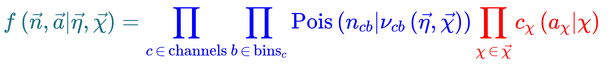
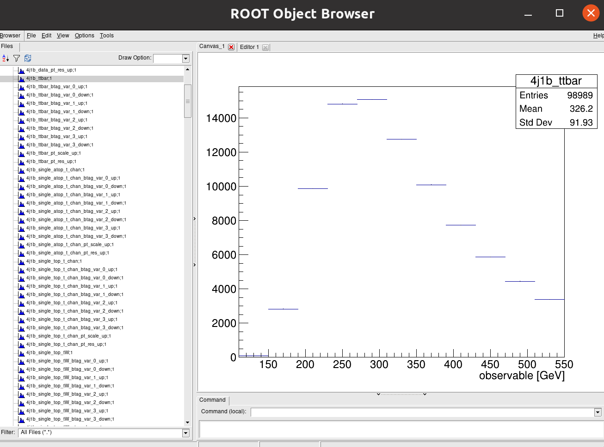
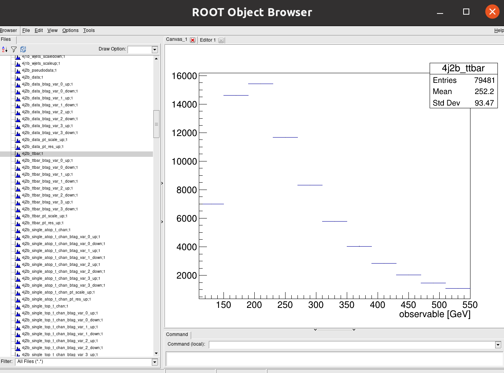
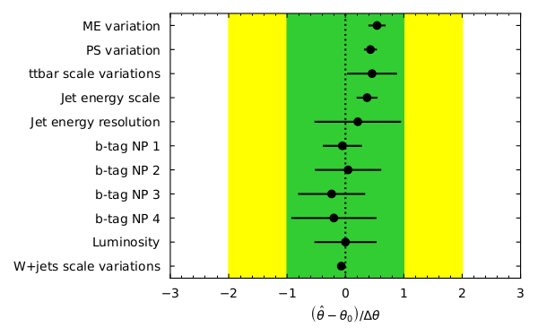
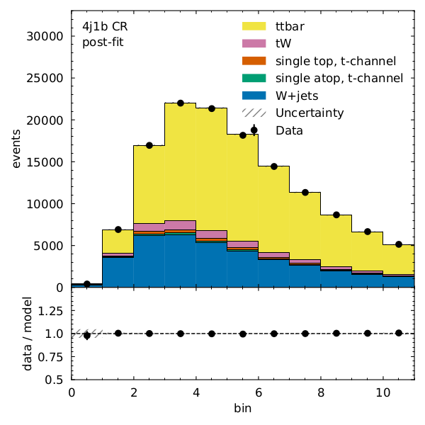
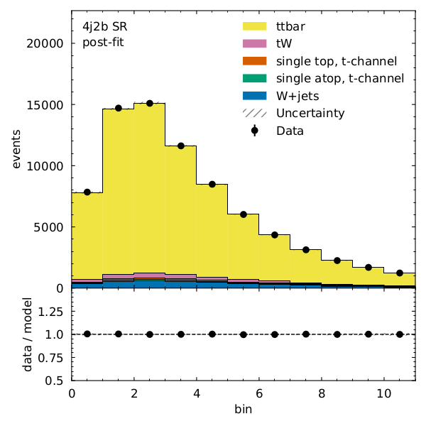

## Systematics in Coffea

In an analysis such as this one there are many systematics to consider, both experimental and theoretical (as encapsulated in the MC).
For the former these include trigger and selection efficiencies, jet energy scale and resolution,
b-tagging and misidentification efficiencies, and integrated luminosity. The latter can include uncertainties
due to choice of hadronizer, choice of generator, QCD scale choices, and the parton shower scale.
This isn't a complete list of systematics and here we will only cover a few of these.

Let's explore the different ways in which one can introduce the estimation of systematic uncertainties in Coffea.  A few examples, which are relevant for our analysis, have been implemented by the original $$t\bar{t}$$ AGC demonstration.  Of course, they are part of our `coffeaAnalysis_ttbarljets.py` code.  Let's explore the different pieces:

Before, we begin, note that a multidimensional array for histograms has been booked:

~~~
#--------------------
    def __init__(self):
    #--------------------
        num_bins = 25
        bin_low = 50
        bin_high = 550
        name = "observable"
        label = "observable [GeV]"
        #https://hist.readthedocs.io/en/latest/user-guide/quickstart.html
        #StrCat = StrCategory
        #https://hist.readthedocs.io/en/latest/banner_slides.html?highlight=StrCategory#many-axis-types
        self.hist = (
            hist.Hist.new.Reg(num_bins, bin_low, bin_high, name=name, label=label)
            .StrCat(["4j1b", "4j2b"], name="region", label="Region")
            .StrCat([], name="process", label="Process", growth=True)
            .StrCat([], name="variation", label="Systematic variation", growth=True)
            .Weight()
        )
~~~
{: .language-python}

The different **processes** (associated with our main datasets for data, signal and backgrounds) and **variations** (also datasets but variations of the *nominal* one) are passed to the Processor:

~~~
 #-------------------------
    def process(self, events):
    #-------------------------
        histogram = self.hist.copy()

        process = events.metadata["process"]  # "ttbar" etc.
        variation = events.metadata["variation"]  # "nominal", "scaledown", etc.

        #print(f'Currently doing variation {variation} for {process}')
~~~
{: .language-python}

Monte Carlo simulations are normalized to the actual luminosity.  Cross sections and numbers of total events for the different samples are also passed to the Processor.  They are handled by the `utils.py` program, as you may remember:

~~~
# normalization for MC
        x_sec = events.metadata["xsec"]
        nevts_total = events.metadata["nevts"]
        # This lumi number was obtained with
        # brilcalc lumi -c web -i Cert_13TeV_16Dec2015ReReco_Collisions15_25ns_JSON_v2.txt -u /pb --normtag normtag_PHYSICS_2015.json  --begin 256630 --end 260627 > lumi2015D.txt
        # lumi in units of /pb
        lumi = 2256.38
        if process != "data":
            xsec_weight = x_sec * lumi / nevts_total
        else:
            xsec_weight = 1
~~~
{: .language-python}

There are several ways in which one can introduce systematic variations.  A built-in option provided by Coffea, `add_systematics`, is the easiest.  Here an example of a made up variation for the scale of the `wjets` contribution:

~~~
#### systematics
        # example of a simple flat weight variation, using the coffea nanoevents systematics feature
        # https://github.com/CoffeaTeam/coffea/blob/20a7e749eea3b8de4880088d2f0e43f6ef9d7993/coffea/nanoevents/methods/base.py#L84
        # Help on method add_systematic in module coffea.nanoevents.methods.base:
        # add_systematic(name: str, kind: str, what: Union[str, List[str], Tuple[str]], varying_function: Callable)
        # method of coffea.nanoevents.methods.base.NanoEventsArray instance
        if process == "wjets":
            events.add_systematic("scale_var", "UpDownSystematic", "weight", flat_variation)
~~~
{: .language-python}

We do have per-jet variations in our ntuples now, but by the time this AGC demonstrator was written we did not.  This is an example of how to add variatinos for jet energy scale and resolution with a per-event *number*.  To make use of the information we have without varying the code too much, we test a silly average for the jet energy scale:

~~~
# example on how to get jet energy scale / resolution systematics
        # need to adjust schema to instead use coffea add_systematic feature, especially for ServiceX
        # cannot attach pT variations to events.jet, so attach to events directly
        # and subsequently scale pT by these scale factors
        events["pt_nominal"] = 1.0
        #events["pt_scale_up"] = 1.03
        # we have already these corrections in our data for this workshop, so we might as well use them
        # to assign a variation per jet and not per event. However, to avoid messing too much with this code, 
        # try a silly thing just for fun: take the average of jet variations per event (fill out the None values with a default 1.03)
        events['pt_scale_up'] = ak.fill_none(ak.mean(events.jet.corrptUp/events.jet.corrpt,axis=1),1.03)
        events["pt_res_up"] = jet_pt_resolution(events.jet.corrpt)

        pt_variations = ["pt_nominal", "pt_scale_up", "pt_res_up"] if variation == "nominal" else ["pt_nominal"]

~~~
{: .language-python}

The routine then loops over these different types of variations also separating the two signal and control regions, performing the same basic analysis we defined before:

~~~
for pt_var in pt_variations:
    ...
    for region in ["4j1b", "4j2b"]:

~~~
{: .language-python}

For the nominal samples, it is this snippet which introduces the scale variation which might have been included earlier (this is the case for the `wjets` above):

~~~
if variation == "nominal":
                        # also fill weight-based variations for all nominal samples
                        # this corresponds to the case for wjets included above as an example
                        for weight_name in events.systematics.fields:
                            for direction in ["up", "down"]:
                                # extract the weight variations and apply all event & region filters
                                weight_variation = events.systematics[weight_name][direction][f"weight_{weight_name}"][event_filters][region_filter]
                                # fill histograms
                                histogram.fill(
                                    observable=observable, region=region, process=process, variation=f"{weight_name}_{direction}", weight=xsec_weight*weight_variation
                                )

~~~
{: .language-python}

Finally an example of how to generate variations that may depend on objects properties, like jet $$p_{T}$$ for the b-tagging.  Note that we already have these variations included in our ntuples but chose not to use them to preserve this version of the demonstration:

~~~
# calculate additional systematics: b-tagging variations
                        for i_var, weight_name in enumerate([f"btag_var_{i}" for i in range(4)]):
                            for i_dir, direction in enumerate(["up", "down"]):
                                # create systematic variations that depend on object properties (here: jet pT)
                                if len(observable):
                                    weight_variation = btag_weight_variation(i_var, selected_jets_region.corrpt)[:, i_dir]
                                else:
                                    weight_variation = 1 # no events selected
                                histogram.fill(
                                    observable=observable, region=region, process=process, variation=f"{weight_name}_{direction}", weight=xsec_weight*weight_variation
                                )
~~~
{: .language-python}

## Introduction to stats analysis

>
>It's beyond the scope of this tutorial to cover a lot of statistical background needed
>here. You may find some references at the end of this episode and further references found within.
>We will cover hopefully the bare-minimum needed to give you an idea of what's going on here
>and to give an introduction to some useful tools.
>
{: .testimonial}

A statistical model $$ f(\vec{x} \vert \vec{\phi}) $$ describes the probability of the data
$$ \vec{x} $$ given model paramters $$ \vec{\phi} $$. 

[HistFactory](https://cds.cern.ch/record/1456844) is a tool to construct probabilty distribution
functions from template histograms, constructing a likelihood function. In this exercise we will be
using HistFactory via [pyhf](https://pyhf.readthedocs.io), a python implementation of this tool. In addition,
we will be using the cabinetry package, which is a python library for constructing and
implementing HistFactory models.

The HistFactory template model can expressed like this:
{:width="50%"}

What's here?
* $$ \vec{n} $$ describes the observed channel data and $$ \vec{a} $$ describes the auxiliary data e.g. from calibration
* $$ \vec{\eta} $$ describes the unconstrained parameters (parameters of interest POI) and $$ \vec{\chi} $$ the constrained parameters (nuisance parameters NPs)
* $$ n_{cb} $$: the observed number of events, $$ \nu_{nb}(\vec{\eta}, \vec{\chi}) $$: expected number of events
*  Main poisson p.d.f. for simultaneous measurement over multiple channels (or regions, like a signal region and a control region) and bins (over the histograms)
* Constraint p.d.f which encodes systematic uncertainties: the actual function used depends on the parameter (e.g. it may be a Gaussian)
* Parameters of interest (POIs): examples in analyses include $$ \sigma \times B $$, $$ m_{W} $$, ...
* Nuisance parameters (NPs): other parameters needed to define the model, e.g. luminosity 

This is a lot to take in but we'll press on regardless with implementation.

Essentially:

* `HistFactory` is a model used for binned statistical analysis
* `pyhf` is a python implementation of this model
* `cabinetry` creates a statistical model from a specification of cuts, systematics, samples, etc.
* `pyhf` then turns this model into a likelihood function

## Making models and fitting

>
> It should be noted that everything in this part is contained in the `use_cabinetry.py` script.
> This file can be found in your copy of the lesson repository
>
{: .testimonial}

Let's start by importing the necessary modules (if you haven't already), most importantly `cabinetry`:
~~~
import logging
import cabinetry
~~~
{: .language-python}

If `cabinetry` is not installed:
~~~
pip install cabinetry
~~~
{: .language-bash}

### Histograms

Let's quickly inspect our histograms in the `histograms.root` file by running ROOT and opening
up a TBrowser.

>
> Try this if you have ROOT installed and have gone through the [ROOT pre-exercise](https://cms-opendata-workshop.github.io/workshop2022-lesson-cpp-root-python/).
> If not, skip this part and try it later. We'll show the output below anyway.
>
{: .testimonial}

~~~
root histograms.root
~~~
{: .language-bash}

~~~
   ------------------------------------------------------------------
  | Welcome to ROOT 6.26/00                        https://root.cern |
  | (c) 1995-2021, The ROOT Team; conception: R. Brun, F. Rademakers |
  | Built for linuxx8664gcc on Jun 14 2022, 14:46:00                 |
  | From tag , 3 March 2022                                          |
  | With c++ (Ubuntu 9.4.0-1ubuntu1~20.04.1) 9.4.0                   |
  | Try '.help', '.demo', '.license', '.credits', '.quit'/'.q'       |
   ------------------------------------------------------------------

root [0] 
Attaching file histograms.root as _file0...
(TFile *) 0x563baef326f0
root [1] TBrowser b
(TBrowser &) Name: Browser Title: ROOT Object Browser
~~~
{: .output}

Click on one of the histogram titles on the left ofr `4j1b` to view it:

{:width="50%"}

Click on another for `4j2b`:

{:width="50%"}

Recall that our observable for the `4j1b` control region is the scalar sum of jet transverse momentum, $$ H_{T} $$ and our observable for the `4j2b` signal region is the mass of b-jet system $$ m_{b_{jj}} $$.

### Cabinetry workspace

A statistical model can be define in a declarative way using cabinetry, capturing the 
$$ \mathrm{region \otimes sample \otimes systematic} $$ structure. 

General settings `General:`, list of phase space regions such as signal and control regions `Regions:`, list of samples (MC and data) `Samples:`, list of systematic uncertainties `Systematics:`, and a list of normalization factors `NormFactors:`.

Let's have a look at each of the parts of the the configuration file:

#### General

~~~
General:
  Measurement: "CMS_ttbar"
  POI: "ttbar_norm"
  HistogramFolder: "histograms/"
  InputPath: "histograms.root:{RegionPath}_{SamplePath}{VariationPath}"
  VariationPath: ""
~~~
{: .language-yaml}

#### Regions

~~~
Regions:
  - Name: "4j1b CR"
    RegionPath: "4j1b"

  - Name: "4j2b SR"
    RegionPath: "4j2b"
~~~
{: .language-yaml}

#### Samples

~~~
Samples:
  - Name: "Pseudodata"
    SamplePath: "pseudodata"
    Data: True

  - Name: "ttbar"
    SamplePath: "ttbar"

  - Name: "W+jets"
    SamplePath: "wjets"

  - Name: "single top, t-channel"
    SamplePath: "single_top_t_chan"

  - Name: "single atop, t-channel"
    SamplePath: "single_atop_t_chan"
    
  - Name: "tW"
    SamplePath: "single_top_tW"
~~~ 
{: .language-yaml}

#### Systematics

~~~
Systematics:
  - Name: "ME variation"
    Type: "NormPlusShape"
    Up:
      VariationPath: "_ME_var"
    Down:
      Symmetrize: True
    Samples: "ttbar"

  - Name: "PS variation"
    Type: "NormPlusShape"
    Up:
      VariationPath: "_PS_var"
    Down:
      Symmetrize: True
    Samples: "ttbar"
~~~
{: .language-yaml}

Here we specify which systematics we want to take into account. In addition to the W+jets scale variations, b-tagging variations, and jet energy scale and resolution (shown in the full file) we show here for the `ttbar` samples `_ME_var` (what do the result look like if we choose another generator?) and `_PS_var` (what do the results look like if we use a different hadronizer?). 

#### NormFactors

~~~
NormFactors:
  - Name: "ttbar_norm"
    Samples: "ttbar"
    Nominal: 1.0
    Bounds: [0, 10]
~~~
{: .language-yaml}

### Running cabinetry and results

Let's load the `cabinetry` configuration file and combine the histograms into a `pyhf` workspace which we will save:
~~~
config = cabinetry.configuration.load("cabinetry_config.yml")
cabinetry.templates.collect(config)
ws = cabinetry.workspace.build(config)
cabinetry.workspace.save(ws, "workspace.json")
~~~
{: .language-python}

`pyhf` can be run on the command line to inspect the workspace:
~~~
pyhf inspect workspace
~~~
{: .language-bash}

which outputs the following:
~~~
                 Summary       
            ------------------  
               channels  2
                samples  5
             parameters  14
              modifiers  14

               channels  nbins
             ----------  -----
                4j1b CR   11  
                4j2b SR   11  

                samples
             ----------
                 W+jets
 single atop, t-channel
  single top, t-channel
                     tW
                  ttbar

            parameters  constraint              modifiers
             ----------  ----------              ----------
  Jet energy resolution  constrained_by_normal   histosys,normsys
       Jet energy scale  constrained_by_normal   histosys,normsys
             Luminosity  constrained_by_normal   normsys
           ME variation  constrained_by_normal   histosys,normsys
           PS variation  constrained_by_normal   histosys,normsys
W+jets scale variations  constrained_by_normal   histosys,normsys
             b-tag NP 1  constrained_by_normal   histosys,normsys
             b-tag NP 2  constrained_by_normal   histosys,normsys
             b-tag NP 3  constrained_by_normal   histosys,normsys
             b-tag NP 4  constrained_by_normal   histosys,normsys
      staterror_4j1b-CR  constrained_by_normal   staterror
      staterror_4j2b-SR  constrained_by_normal   staterror
 ttbar scale variations  constrained_by_normal   histosys,normsys
             ttbar_norm  unconstrained           normfactor

            measurement           poi            parameters
             ----------        ----------        ----------
          (*) CMS_ttbar        ttbar_norm        ttbar_norm

~~~
{: .output}

Now we perform our maximum likelihood fit
~~~
model, data = cabinetry.model_utils.model_and_data(ws)
fit_results = cabinetry.fit.fit(model, data)
~~~
{: .language-python}

and visualize the pulls of parameters in the fit:
~~~

pull_fig = cabinetry.visualize.pulls(
    fit_results, exclude="ttbar_norm", close_figure=True, save_figure=True
)
~~~
{: .language-python}

{:width="50%"}

What are pulls? For our nuisance parameters in the fit the pull is defined as $$ (\hat{\theta} - \theta_{0}) / \Delta\theta $$, which is the
difference between the fitted parameter value and the initial value divided by the width. Looking at the pulls can aid in seeing how well (or how badly)
your fit performed. For unbiased estimates and correctly estimated uncertainties, the pull should have a central value of 0 and an uncertainty of 1.
If the central value is not 0 then some data feature differs from the expectation which may need investigation if large. If the uncertainty is less than 1
then something is constrained by the data. This needs checking to see if this is legitimate or a modeling issue.

Note that the figures produced by running the script or your commands are to be found in the
`figures/` directory.

What does the model look like before and after the fit? We can visualize each with the following
code:
~~~
model_prediction = cabinetry.model_utils.prediction(model)
figs = cabinetry.visualize.data_mc(model_prediction, data, close_figure=True)

model_prediction_postfit = cabinetry.model_utils.prediction(model, fit_results=fit_results)
figs = cabinetry.visualize.data_mc(model_prediction_postfit, data, close_figure=True)
~~~
{: .language-python}

We can see that there is very good post-fit agreement:
{:width="50%"}
{:width="50%"}

Finally, what's the $$ t\bar{t} $$ cross section (for our pseudodata) divided by the Standard Model prediction?
~~~
poi_index = model.config.poi_index
print(f"\nfit result for ttbar_norm: {fit_results.bestfit[poi_index]:.3f} +/- {fit_results.uncertainty[poi_index]:.3f}")
~~~
{: .language-python}
~~~
fit result for ttbar_norm: 0.964 +/- 0.075
~~~
{: .output}

> Phew. We covered a lot in a very short time but essentially:
> * Coffea allows for addition of systematic variations
> * Our likelihood structure allows us to include systematics as uncertainties on NPs
> * The statistical model uses the HistFactory template
> * This is implemented using `pyhf` and `cabinetry`
>
> What wasn't covered? A lot. But hopefully there is enough here to get you started.
{: .keypoints}

## References and further reading

* [cabinetry](https://cabinetry.readthedocs.io/en/latest/index.html)
* [pyhf](https://pyhf.readthedocs.io)
* [HistFactory](https://cds.cern.ch/record/1456844)

## Acknowledgements

Thanks to the authors of the [AGC using CMS data](https://github.com/iris-hep/analysis-grand-challenge) on which much of the episode was based.


